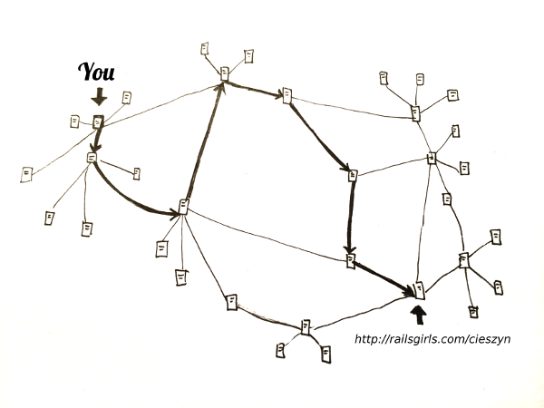
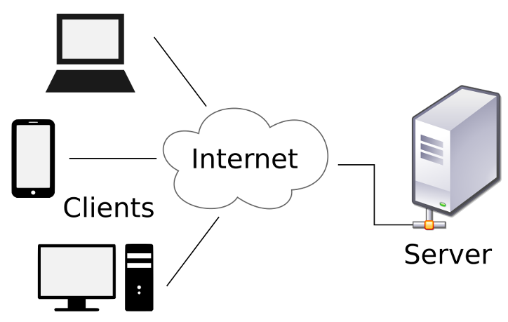
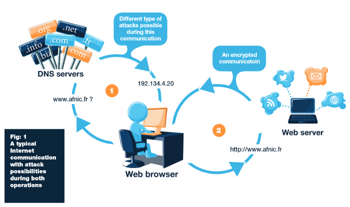
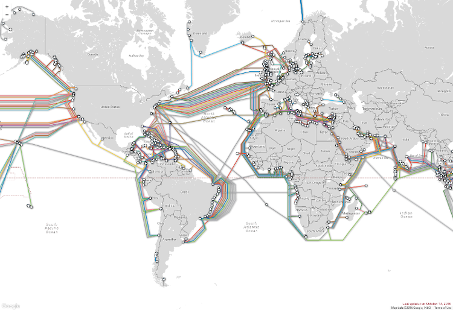

name: inverse
layout: true
class: center, middle, inverse
---
# How the Internet Works?
[as simple as posible]

.footnote[[Alex Malaszkiewicz](http://github.com/torrocus), Developer at [Fractal Soft](http://fractalsoft.org)]

---

layout: false
class: center, middle

Internet is so complicated

---

layout: false
class: center, middle

# Browser window

---

layout: false
class: center, middle

# Browsers

---

layout: false
class: center, middle

# Internet

---

layout: false
class: center, middle

# Unicorn

---

layout: false
class: center, middle

---

layout: false
class: center, middle

---

layout: false
class: center, middle

---

layout: false
class: center, middle

---

layout: false
class: center, middle

Submarine Cable Map

---

layout: false
class: center, middle

# Most important thing in the Internet

---

name: last-page
template: inverse

## Contact
Find me on:

twitter: @torrocus

facebook: torrocus

github: torrocus

instagram: torrocus
